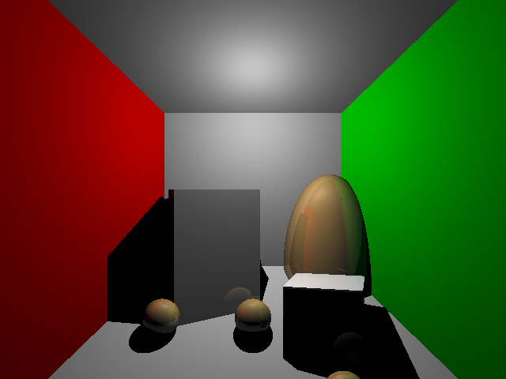
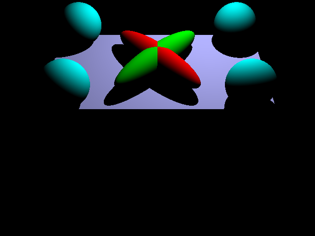
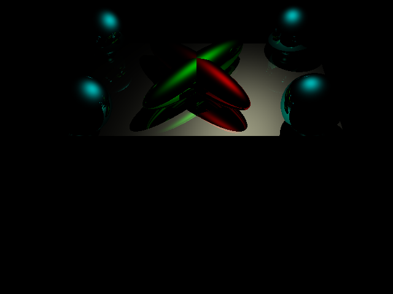

# RayTracing

```bash
git clone https://github.com/Fnjn/rayTracing.git
cd rayTracing
make
./transforms (your-test-scenes)
```
Sample test scenes are listed in `testscenes` folder.

## Example Scenes
#### All lighting scene


#### Diffuse lighting scene


#### Specular lighting scene

